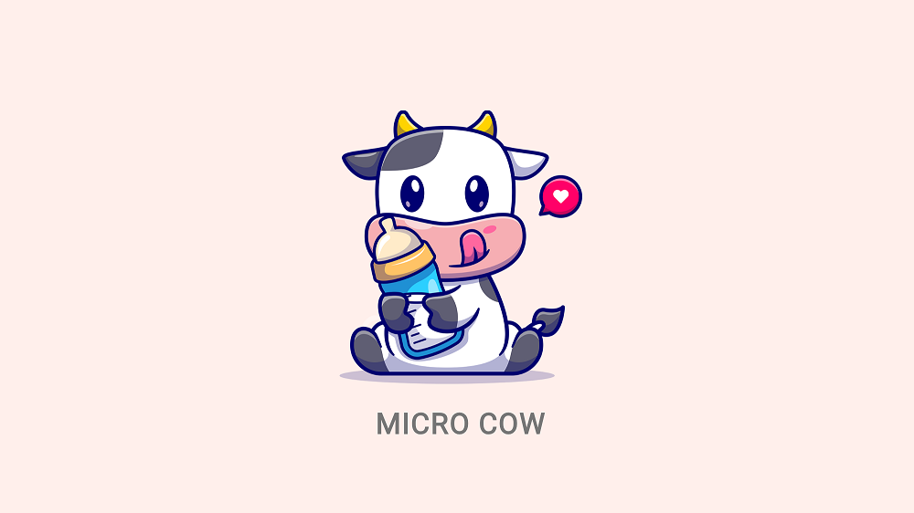

<br>
<div align="center">

<p align="center">Smart contract-based idle game built with Flutter and Linera</p>
</div>

## About Micro Cow

Micro Cow combines Rust-based smart contracts built
with [Linera](https://linera.io/), and a web app client to
access the smart contracts functionality built with one of the most popular
cross-platform
frameworks, [Flutter](https://flutter.dev).

Micro Cow smart contract will cover several capabilities of Linera that exist in the Devnet, which include:

1. Authentication
2. Cross-Chain Messages
3. Custom Types
4. Contract Instantiation
5. Instantiation Argument
6. Application Parameters
7. Channel Subscription

While the Micro Cow web app will cover the following:

1. Setting Linera wallet through calls to node service
2. Calling Linera smart contract function using GraphQL

## Get Started

This article is specifically about the Linera smart contract for Micro Cow.

Discussion of the Micro Cow web app is in
the [Micro Cow App repository](https://github.com/hasToDev/micro_cow_app)

The Micro Cow smart contract in this repository was developed using `Rust version 1.77.2`, `linera-service v0.11.3`,
and `linera-sdk v0.11.3`

## Install Rust, Linera SDK, and Linera Service

The first step you have to do is install Rust. You can follow the steps to install Rust in the following article:

- [Install Rust - Rust Programming Language](https://www.rust-lang.org/tools/install)
- [Walkthrough: Installing Rust on Windows](https://www.alpharithms.com/installing-rust-on-windows-403718/)
- [How To Install Rust on Ubuntu 20.04](https://www.digitalocean.com/community/tutorials/install-rust-on-ubuntu-linux)

Next we install Linera SDK and Linera Service:

```
cargo install --locked linera-sdk@0.11.3
cargo install --locked linera-service@0.11.3
```

Confirm that both Rust and Linera CLI are installed by running `rustc --version` and `linera --version`.

You should receive a result that is more or less similar to:

```text
rustc 1.77.2 (25ef9e3d8 2024-04-09)

Linera protocol: v0.11.3
RPC API hash: package not used
GraphQL API hash: package not used
WIT API hash: package not used
Source code: https://github.com/linera-io/linera-protocol/tree/v0.11.3
```

You should be aware that currently we can't install Linera Service on Windows.

Please refer to the following installation document from Linera dev team:
[Linera Installation](https://linera.dev/developers/getting_started/installation.html)

## Clone, Build, and Deploy

Before we build and deploy the contract, we have to prepare a **ChainID** to be used as **Root ChainID** for the **Micro
Cow contract**.

In this example, we will use **ChainID** `b12f5885bb54ea25d26cbb59795e249392b0c8892df11e51c31aea77befbabbb` as the
**Root ChainID** in the `--json-parameters`, and we will set the `--jason-argument` with `500000` **LINERA token** as
starting balance for the **Root ChainID**.

1. Clone the repository:
    ```
    git clone https://github.com/hasToDev/micro_cow_linera.git
    ```

2. Build and Deploy the contract:
   ```
   linera project publish-and-create \
   --json-argument '"500000"' \
   --json-parameters "{ \"root_chain_id\": \"b12f5885bb54ea25d26cbb59795e249392b0c8892df11e51c31aea77befbabbb\" }"
   ```

   After the deployment is complete, you will receive an **Application ID**.<br>
   Save the **Application ID** because you will need it when playing the game with Micro Cow app.<br><br>

   The form of **Application ID** will be similar
   to `b12f5885bb54ea25d26cbb59795e249392b0c8892df11e51c31aea77befbabbb000000000000000000000000b12f5885bb54ea25d26cbb59795e249392b0c8892df11e51c31aea77befbabbb020000000000000000000000`<br>

## Prerequisites

To play the Micro Cow game, you will need:

1. a **ChainID** that is different than the **Root ChainID**
2. running `linera service` on your device or local network
3. **Micro Cow Application ID** that was deployed on **Root ChainID** on your device or local network

Lets say in your `linera wallet`, there are 4 **ChainID**:

1. `b12f5885bb54ea25d26cbb59795e249392b0c8892df11e51c31aea77befbabbb`
2. `f0e5dc9ee7e43fd15892ecce4638b4a2d1a1770423152928f895b3b5c2cbb2ba`
3. `3dead76577bb77e16b30deca479efc222f7273cb07d0bc1fc30dc09a402ece4e`
4. `9b66c79b48abec64fa05d6610ff14c84ab667790febb9e2a0abc890b162d7931`

You have use `b12f5885bb54ea25d26cbb59795e249392b0c8892df11e51c31aea77befbabbb` as a **Root ChainID** when you deploy
the Micro Cow contract.

Therefore, you can use the remaining **ChainID** to play the game.

## How It Works

### Game Initialization

On the first time you play Micro Cow, the app will check if Micro Cow exist in your chain. It will make a request to the
root chain if Micro Cow doesn't exist.

After request complete, the contract will then call **CowOperation::Initialize** to initialize a new game account in
your chain.
Your account will start with **10000 LINERA token**.

The contract will also send a channel subscription request to the root chain, so that your chain will stay updated with
all things that happens on root chain.

### Buy the Cow

When we buy a cow in the game, the app will call **CowOperation::BuyCow** on the player chain.

It will then:

1. check if the Cow Name that you want is available
2. check if you have enough balance to buy the cow
3. debit your balance to pay for the cow
4. send **Message::BuyCow** to the root chain

on the root chain, after receiving the **Message::BuyCow**, it will:

1. check if the Cow Name that you want is available
2. send **Message::BuyFailure** back to you because the Cow name is already registered
3. register the new cow
4. credit balance to receive payment
5. send **Message::BuySuccess** to the channel subscriber if the process succeed

back on the player chain, there are 2 possible message that you will receive at the end of this function call, *
*Message::
BuyFailure** and **Message::BuySuccess**

For the **Message::BuyFailure**, it will:

1. credit the balance back to your account because you fail to buy the cow, and notify player that the buy is a failure
2. save the Cow data that was sent by root chain, this data is existed on root chain state, but not in yours

For the **Message::BuySuccess**, it will:

1. save the new Cow data in all channel subscriber
2. add the new Cow name to buyer's ownership list, and notify player that the buy is a success
3. remove the Cow name from other player's ownership list

### Feed the Cow

When we feed a cow in the game, the app will call **CowOperation::FeedCow** on the player chain.

It will then:

1. make sure that the cow is in your ownership, you aren't allowed to feed another player's cow
2. find out if the cow is hungry or still full
3. update the cow data with the next feeding time
4. send **Message::FeedCow** to the root chain

on the root chain, after receiving the **Message::FeedCow**, it will:

1. save your cow latest data to it's state
2. send **Message::FeedSuccess** to the channel subscriber

back on the subscriber chain, after receiving the **Message::FeedSuccess**, it will save your cow latest data on
subscriber's
state. That way, all subscriber knows that your cow has been fed.

### Sell the Cow

When we sell a cow in the game, the app will call **CowOperation::SellCow** on the player chain.

It will then:

1. make sure that the cow is in your ownership, and still alive
2. find out if the cow is underage, you can't sell any cow that have age less than 3 days
3. send **Message::SellCow** to the root chain
4. on the web app side, the game will ask for your confirmation of Cow selling price. If you agree with the price, then
   and only then the game will call **CowOperation::SellCow** on the contract side

on the root chain, after receiving the **Message::SellCow**, it will:

1. calculate how much the cow is worth, based on its feeding stats
2. check if root chain have enough balance to pay for the cow
3. if the balance not enough, it will send **Message::SellFailure** back to you to notify that root chain can't buy your
   cow, at least at the moment of invocation
4. remove your cow from root chain state
5. debit root chain balance to pay for the cow
6. send **Message::SellSuccess** to the channel subscriber

back on the player chain, there are 2 possible message that you will receive at the end of this function call,
**Message::SellFailure** and **Message::SellSuccess**

For the **Message::SellFailure**, it will only notify the seller that the sell process can't continue for now.

For the **Message::SellSuccess**, it will:

1. remove the Cow name from seller ownership
2. credit the seller balance to receive payment for the cow
3. notify the seller that the sell process is successful
4. remove the Cow data from all subscriber's state

## Query Service

The web app side of Micro Cow game will utilize the unmetered query service on Micro Cow smart contract to get any
required data, to make sure that every operation calls is successful.

Some of the GraphQL query that available in this contracts are:

1. `root_check`: check if this chain is a root chain
2. `status_check`: check the initialization status of this chain
3. `get_owner`: get the owner of this chain
4. `get_balance`: get balance Micro Cow balance for this chain
5. `get_one_buy_notification`: get 1 buy notification if it existed
6. `get_one_sell_notification`: get 1 sell notification if it existed
7. `get_my_cows`: get all the cows owned by this chain
8. `is_cow_alive`: check if a cow with certain name is still alive
9. `get_cow_existence`: check if a cow is existed in local DB, and owned by this chain
10. `is_cow_underage`: check if a cow's age in less than 3 days
11. `get_cow_sell_value`: get a cow appraisal price based on its name & stats
12. `is_cow_still_full`: check if cow still full based on its last feeding time

## License

The Micro Cow is distributed under an MIT license. See the [LICENSE](LICENSE) for more information.

[](https://opensource.org/licenses/MIT)

## Contact

[Hasto](https://github.com/hasToDev) - [@HasToDev](https://twitter.com/HasToDev)
